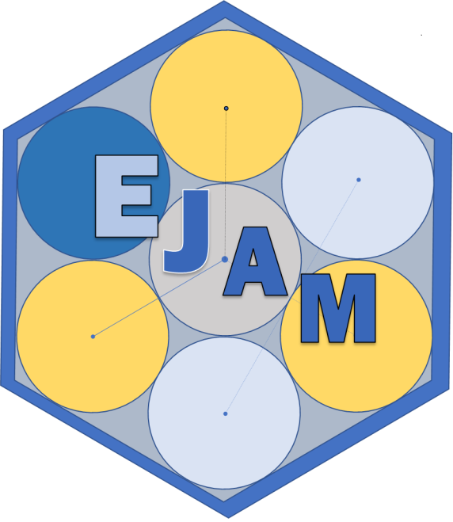

# 

<!-- README.md is generated from README.Rmd. Please edit Rmd not md  -->

```{r, echo=FALSE, eval=FALSE}
# Developer note: 
# If you use index.Rmd or README.Rmd it is your responsibility to 
# knit the document to create the corresponding .md. 
# pkgdown does not do this for you because it only touches 
# files in the ⁠doc/⁠ directory.
#
# 1) Edit your README.Rmd file (the .Rmd NOT the .md file)
# 2) Build your README.md file from the README.Rmd file, by clicking Knit in RStudio
#   also check     devtools::build_readme()  ?
#
# 3) Commit both your README.Rmd and README.md
#
# You could also use GitHub Actions to re-render
# `README.Rmd` every time you push. An example workflow can be found here:
# <https://github.com/r-lib/actions/tree/v1/examples>.
#
# Then... 
#    - **See ?pkgdown::build_site** - EJAM now uses the pkgdown R package to build help and vignettes as web pages, and it uses the README.md (not .Rmd) to help build the documentation.
```

```{r, include = FALSE}
knitr::opts_chunk$set(
  collapse = TRUE,
  comment = "#>",
  fig.path = "man/figures/README-",
  out.width = "100%"
)
```

```{r, eval=TRUE, echo=FALSE, include=FALSE}

code_reponame_with_owner <- EJAM:::repo_from_desc()           # "OWNER/REPONAME"
code_reponame <- gsub(".*/", "", code_reponame_with_owner)    #       "REPONAME"
code_reponame_url <- EJAM:::repo_from_desc(get_full_url = T)   
# "https://github.com/OWNER/REPONAME"

docs_reponame_with_owner <- EJAM:::repo_from_desc('github.io')# "OWNER/REPONAME"
docs_reponame <- gsub(".*/", "", docs_reponame_with_owner)    #       "REPONAME"
docs_reponame_url <- EJAM:::repo_from_desc('github.io', get_full_url = T) 
# "https://OWNER.github.io/REPONAME"

data_reponame_with_owner <- desc::desc(file = system.file(
  "DESCRIPTION", package = "EJAM"))$get("ejam_data_repo")     # "OWNER/REPONAME"
data_reponame <- gsub(".*/", "", data_reponame_with_owner)    #       "REPONAME"
data_reponame_url <- paste0("https://github.com/", data_reponame_with_owner) 
# "https://github.com/OWNER/REPONAME"

whatislink <- paste0(docs_reponame_url, "/articles/0_whatis.html")
deploylink <- paste0(docs_reponame_url, "/articles/dev_deploy-app.html")
```

<!-- badges: start -->

```{=html}
<!-- or we could comment out the badge 

[](https://lifecycle.r-lib.org/articles/stages.html#experimental)
 -->
```
<!-- badges: end -->

The Environmental and Residential Population Analysis Multisite tool lets you easily and quickly see residential population and environmental information aggregated within and across hundreds or thousands of places, all at the same time.

## What Can You Do with EJAM?

[What is EJAM?](`r whatislink`)

## Status of EJAM package 2025

*As of mid-2025, content related to the USEPA-hosted open source R package EJAM may be archived and/or unpublished:*

### code repositories and open source contributions

The open source package EJAM was in a repository *archived and/or unpublished in mid-2025* ([USEPA/EJAM-open](https://github.com/USEPA/EJAM-open)) with no plans for it to be further developed by EPA. Any further development or open source contributions would need to take place elsewhere (not in the EPA repository), such as in forks of the package.

The name of the repo storing the package code needs to be recorded as part of the URL parameter in the DESCRIPTION file in the root folder of the source package. The owner/name can be read from there using the unexported helper function `repo_from_desc()`, and the full URL via the function `repo_from_desc()` as `EJAM:::repo_from_desc(get_full_url=T)` which currently returns `r code_reponame_url`.

### documentation

Documentation webpages had been on github pages at URLs related to the USEPA/EJAM and USEPA/EJAM-open repositories -- but *those might be archived and/or unpublished in mid-2025*, with any subsequent documentation presumably hosted by other repositories such as in forks of the package. The ddocumentation web pages are created via code in `EJAM/data-raw/datacreate_0_UPDATE_ALL_DOCUMENTATION_pkgdown.R`, relying on the R package `{pkgdown}` and hosted on github pages.

The name of the repo where those are published at any given time needs to be recorded as part of the URL parameter in the `DESCRIPTION` file in the root folder of the source package. That repo URL can be read from there using the unexported helper function `repo_from_desc()` as `EJAM:::repo_from_desc('github.io', get_full_url=T)`, which currently returns (`r docs_reponame_url`).

### datasets

Datasets had been in a repository *archived and/or unpublished in mid-2025* ([USEPA/ejamdata](https://github.com/USEPA/ejamdata)) through mid-2025 with no plans for it to be further updated by EPA.

The name of the repo where those are stored at any given time needs to be recorded as the `ejam_data_repo` parameter in the `DESCRIPTION` file in the root folder of the source package, which can be retrieved via the function `desc::desc()` as `desc::desc(file = system.file("DESCRIPTION", package = "EJAM"))$get("ejam_data_repo")` which currently returns `r data_reponame_with_owner`, so the full URL would be `r data_reponame_url`.

### web app hosting

For information about how to host the web app, see [Deploying the Web App](`r deploylink`)

EJScreen and the EJAM/multisite tool web app were *no longer hosted by EPA starting in early 2025*. Changes have been taking place in terms of how and where EJAM or EJScreen might be available as web apps. EJAM as a web app was taken offline at EPA, and EJScreen likewise no longer provides access to EJAM's multisite tool, and does not provide the API that had been generating community summary reports on individual locations. [EJScreen (as archived here)](https://web.archive.org/web/20250118193121/https://www.epa.gov/ejscreen "https://www.epa.gov/ejscreen"){.uri target="_blank" rel="noreferrer noopener"} leveraged EJAM's technology to provide public access to batches of reports, allowing rapid multisite analysis through EJScreen's Multisite Tool. The web app attempted to balance user-friendliness of the visual interface and features, relevance to what the public finds useful, and resources that include appropriate documentation and user support.
